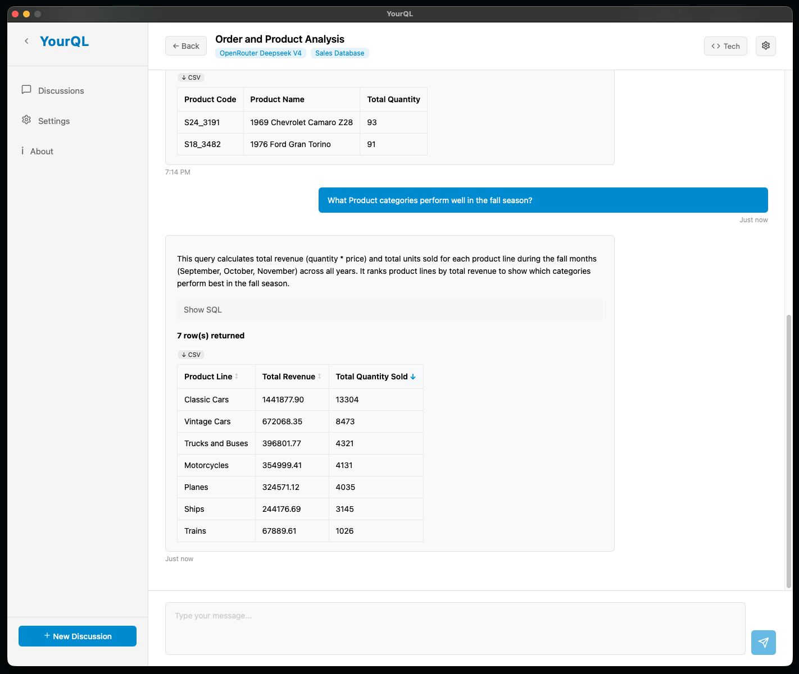
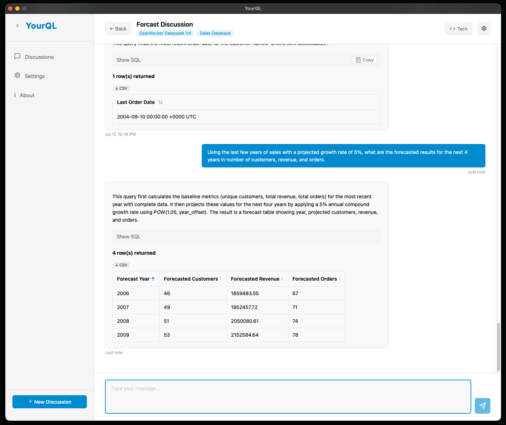
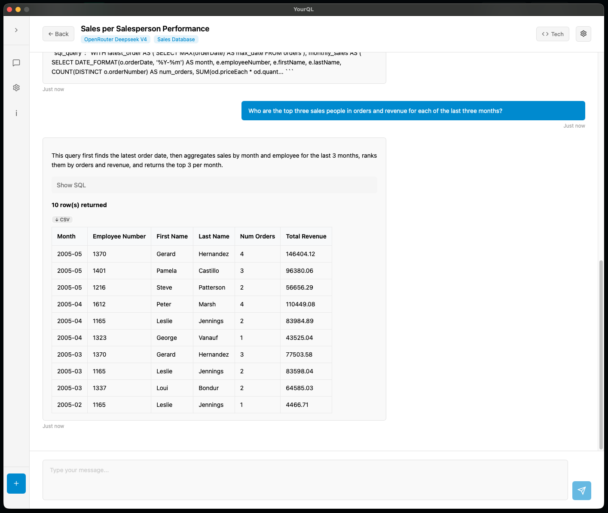
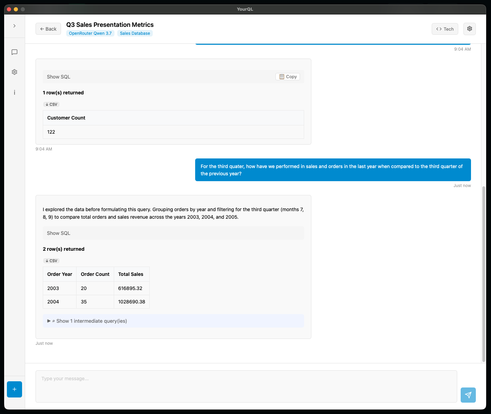
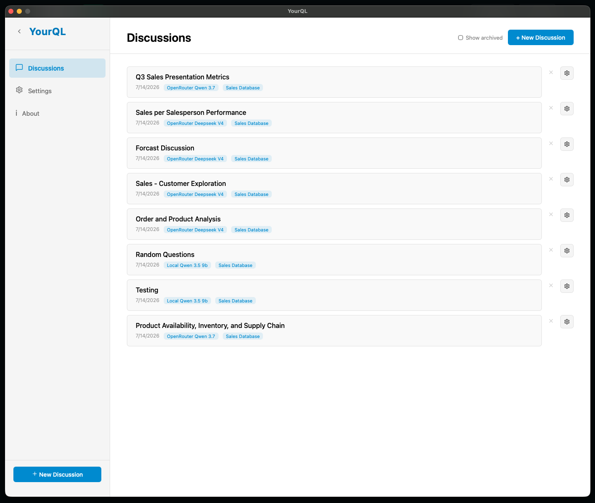
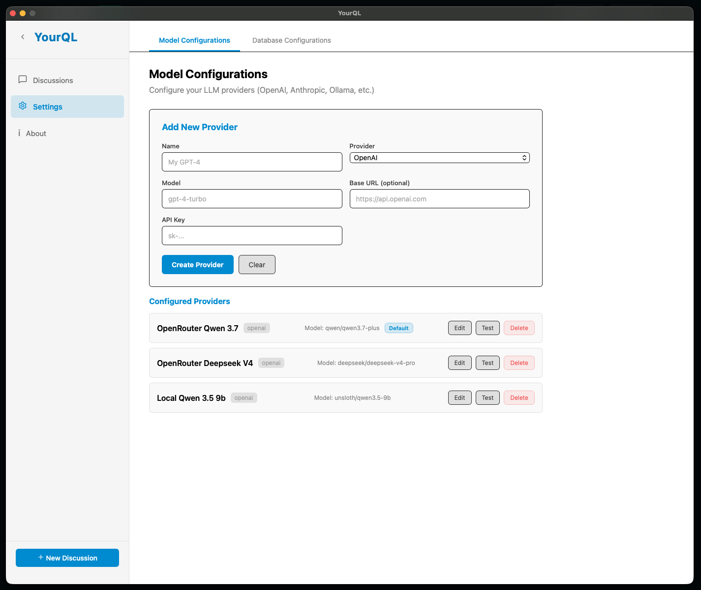

# YourQL

## Overview
**YourQL** is a desktop application built with [Wails v2](https://wails.io/). It focuses entirely on the core functionality of conversational database querying and LLM integration, providing a clean chat-like interface for interacting with databases via natural language.

The application bridges the gap between natural language and SQL, allowing users to interact with their databases via a chat-like interface powered by Large Language Models (LLMs).

## Screenshots

<p align="center">
  
  
</p>

<p align="center">
  
  
</p>

<p align="center">
  
  
</p>

---
## Architecture
YourQL follows the standard Wails architecture, combining a Go-based backend with a Svelte 5-based frontend:

1. **Core Engine (`pkg/services/`)**: Contains the "Discussion Engine" logic. This includes the `ProcessUserMessage` function, which orchestrates the conversation loop: fetching context, calling the LLM, parsing JSON responses, and executing SQL.
2. **Database Layer (`pkg/models/`)**: Handles all database interactions using GORM and the modernc.org/sqlite driver. It defines the data structures for conversations, messages, and database connections.
3. **Wails Bindings (`app.go`)**: The gateway between the frontend and the backend. It exposes Go functions (like `ListConversations`, `ProcessUserMessage`) to the Svelte frontend.
4. **LLM Integration (`pkg/services/llm_*.go`)**: Provides a unified interface for multiple LLM providers (OpenAI, Anthropic, Ollama, and local models).

## Project Structure
```text
YourQL/
├── app.go                      # Wails application struct and bindings
├── main.go                     # Application entry point
├── go.mod / go.sum             # Go dependencies
├── wails.json                  # Wails configuration
├── pkg/                        # Core business logic
│   ├── models/                 # Data structures and DB schemas
│   │   ├── conversation.go     # Conversation and message models
│   │   ├── db_connection.go    # Database connection models
│   │   ├── llm_provider.go     # LLM provider models
│   │   └── setup.go            # DB initialization and migrations
│   ├── services/               # Business logic
│   │   ├── discussion_engine.go # Core conversation orchestration
│   │   ├── conversation.go     # Conversation persistence
│   │   ├── sql_execution.go    # SQL execution and retry logic
│   │   ├── database_introspection.go # Schema fetching
│   │   ├── database_connection.go # Connection management
│   │   ├── llm_client.go       # LLM interface definition
│   │   ├── llm_openai.go       # OpenAI-compatible provider
│   │   ├── llm_anthropic.go    # Anthropic Claude provider
│   │   ├── llm_ollama.go       # Ollama provider
│   │   ├── llm_local.go        # Custom local model provider
│   │   └── llm_mock.go         # Mock provider for testing
│   └── controllers/            # API-like handlers (adapted for Wails)
└── frontend/                   # Svelte 5 UI
    ├── src/
    │   ├── App.svelte          # Main application component
    │   ├── ConversationView.svelte # Conversation display and input
    │   ├── SettingsView.svelte     # Settings management
    │   └── main.js             # Entry point
    ├── wailsjs/                # Auto-generated Wails bindings
    └── package.json            # Frontend dependencies
```

## Backend Details

### Core Components
The backend of YourQL is built on a robust set of services that work together to provide the "Discussion Engine" capabilities:

#### 1. Discussion Engine (`pkg/services/discussion_engine.go`)
- The heart of the application. It manages the state of a conversation, interacts with the LLM, and handles the logic for SQL generation and execution.
- **Exploration Mode**: Supports "exploration rounds" where the LLM can run intermediate queries to gather data before formulating a final answer.
- **Safety Constraints**: Enforces read-only restrictions on exploration queries to prevent accidental data modification.
- **Context Management**: Automatically injects database schema into the LLM context via `buildSystemPrompt`.
- **System Prompt Capping**: If the system prompt exceeds 16KB, it is truncated to prevent context window overflow.
- **Retry Logic**: Handles LLM clarification responses and retry scenarios for final query generation.

#### 2. LLM Client (`pkg/services/llm_client.go`)
- A unified interface for interacting with different LLM providers.
- **Supported Providers**:
  - **OpenAI** (`llm_openai.go`): Supports GPT-4 and other OpenAI-compatible models (OpenRouter, LM Studio, etc.).
  - **Anthropic** (`llm_anthropic.go`): Supports Claude models.
  - **Ollama** (`llm_ollama.go`): For local, self-hosted models.
  - **Local** (`llm_local.go`): For custom HTTP endpoints supporting both OpenAI-compatible and legacy API formats.
  - **Mock** (`llm_mock.go`): For testing without an actual LLM.

#### 3. SQL Execution (`pkg/services/sql_execution.go`)
- Handles the execution of SQL queries against the configured database connection.
- Includes retry logic for transient errors and provides a mechanism to feed error messages back to the LLM for self-correction.

#### 4. Database Introspection (`pkg/services/database_introspection.go`)
- Automatically fetches the schema of the connected database (tables, columns, indexes, foreign keys).
- **Multi-DB Support**: Uses `INFORMATION_SCHEMA` for MySQL and `pragma_table_info()` for SQLite.
- This schema is injected into the LLM's context to ensure generated SQL is accurate and compatible.

#### 5. Conversation Management (`pkg/services/conversation.go`)
- Persists conversations and messages to the local SQLite database (`~/.yourql/yourql.db`).
- Supports soft delete for discussions with proper status tracking.
- Manages metadata for storing LLM payloads and exploration results.

### Database Storage
YourQL uses a local SQLite database for all application data:
- **Location**: `~/.yourql/yourql.db`
- **Auto-creation**: Directory and database are created automatically on first run
- **Migration Strategy**: Uses `CREATE TABLE IF NOT EXISTS` + `addColumnIfNotExists()` helper for safe schema evolution
- **SQLite Driver**: Uses `modernc.org/sqlite` (pure Go, no CGO) to avoid cross-compilation issues
- **Date Functions**: Uses `CURRENT_TIMESTAMP` (not `NOW()`) for SQLite compatibility

### Configuration
Configuration is stored in the local SQLite database, not in `.env` files. Users manage settings through the Settings UI:
- **Model Configurations**: LLM provider settings (name, type, model, base URL, API key)
- **Database Configurations**: External database connections (MySQL, SQLite) with introspection
- **General Settings**: Application-wide preferences

### Dependencies
The project uses the following major Go modules:
- **Wails v2**: For the desktop framework
- **GORM**: For database ORM operations
- **modernc.org/sqlite**: Pure Go SQLite driver (no CGO)
- **github.com/go-sql-driver/mysql**: MySQL driver registration
- **github.com/samber/lo**: Functional helpers

## Frontend and Wails Integration

### Technology Stack
- **Svelte 5**: Used for building the reactive user interface
- **Vite**: Used as the build tool and development server
- **Wails Runtime**: Provides the bridge between the Go backend and the JavaScript frontend

### Wails Bindings
Wails automatically generates TypeScript and JavaScript bindings that allow the Svelte frontend to call Go functions. These are located in `frontend/wailsjs/go/main/`.

Regenerate bindings after adding new Go methods:
```bash
~/go/bin/wails generate module
```

### UI Implementation

#### Sidebar Navigation
- **Discussions**: List of conversations with actual LLM provider and DB connection names
- **Settings**: Three tabs for configuration management

#### Conversation View (`ConversationView.svelte`)
- **Message Display**: User and assistant messages with Markdown support
- **Input**: Textarea with send button
- **Tech Toggle**: Show/hide intermediate engine messages (raw SQL, exploration results, LLM payloads)
- **Exploration Results**: Displays intermediate SQL queries and their results when tech details are enabled
- **Raw LLM Payloads**: Shows full request/response JSON with copy button when tech details are enabled

#### Settings View (`SettingsView.svelte`)

**Model Configurations Tab**
- List of configured LLM providers
- Add/edit/delete providers
- Test connections

**Database Configurations Tab**
- **List View**: Horizontal list of database connections with type badges
- **Detail View**: Click any connection to see full configuration:
  - Connection info (name, type, host, port, database, credentials)
  - Custom system prompt
  - Business rules (one per line)
  - Exploration settings (allow exploration, max rounds, safety mode)
  - **Editable Schema**: Load and view database schema with inline table/column description editing
  - Actions: Save, Test Connection, Delete

**General Settings Tab**
- Application-wide preferences

### Styling
The UI uses a clean, light theme with:
- White background, black text, blue accents
- Flexbox layout for responsive design
- Card-style containers for settings and conversation items

---

## Key Implementation Details

### Svelte 5 Patterns Used
- **`$props()` rune**: For component props (replaces `export let`)
- **`$state()`**: For ALL reactive local state
- **`$derived(expr)`**: For computed values (not `$derived let x = $state(...)`)
- **`$effect()`**: For syncing derived state
- **Callback pattern**: For child→parent data flow
- **`onclick`**: Event handlers (no colon syntax)
- **`{@html}`**: For safe HTML rendering

### Go Patterns Used
- **`make([]*Type, 0)`**: For empty slices (prevents `nil` serializing to `null` in JSON)
- **`addColumnIfNotExists()`**: Safe column addition for SQLite migrations
- **`_ "github.com/go-sql-driver/mysql"`**: Required for driver registration

### SQLite Date Functions
- Use `CURRENT_TIMESTAMP` (not `NOW()`) for SQLite compatibility

### LLM Client Interface
```go
type LLMClient interface {
    ChatCompletion(ctx context.Context, messages []ChatMessage) (string, error)
    ChatCompletionWithPayload(ctx context.Context, messages []ChatMessage) (content, requestJSON, responseJSON string, err error)
}
```
- `ChatCompletionWithPayload` captures full request/response JSON for debugging
- Payloads are stored in `conversation_messages` as metadata for `exploration`-role messages

### Exploration Queries
Per-connection configuration stored as JSON in `db_connections.config`:
- `exploration_allowed`: Enable/disable exploration
- `max_exploration_rounds`: Maximum intermediate query rounds
- `exploration_safety`: Safety mode (strict/relaxed/permissive)
- `system_prompt`: Custom system prompt for this connection
- `business_rules`: Business rules injected into system prompt
- `table_descriptions`: Custom table descriptions
- `column_descriptions`: Custom column descriptions (format: `table.column`)

### Technical Details Toggle
Per-discussion boolean stored in `tech_details` column:
- **OFF**: Shows only user and assistant messages
- **ON**: Shows all intermediate engine messages including:
  - Exploration SQL queries and results
  - Raw LLM request/response JSON
  - Full LLM message array
  - Copy button for payloads

### Soft Delete
Discussions are soft-deleted via `status = 'deleted'` and `deleted_at = CURRENT_TIMESTAMP`. List queries filter on `status != 'deleted'` (safe column that always exists).

---

## Development

### Prerequisites
- Go 1.21+
- Node.js 18+
- Wails CLI: `go install github.com/wailsapp/wails/v2/cmd/wails@latest`

### Building
```bash
# Generate Wails bindings
~/go/bin/wails generate module

# Build Go backend
go build .

# Build frontend
cd frontend && npm run build

# Run in dev mode
wails dev
```

### Running
```bash
wails dev
```

### Testing
- Test LLM connections from Settings → Model Configurations → Test button
- Test DB connections from Settings → Database Configurations → Detail View → Test Connection
- View schema from Settings → Database Configurations → Detail View → Load Schema

---

## Known Limitations
- Small models (e.g., qwen3.5-0.8b) may not handle consecutive same-role messages well
- System prompt is capped at 16KB to prevent context overflow
- LLM base URLs must include `/v1` prefix for OpenAI-compatible endpoints (e.g., `http://192.168.0.176:1234/v1`)
