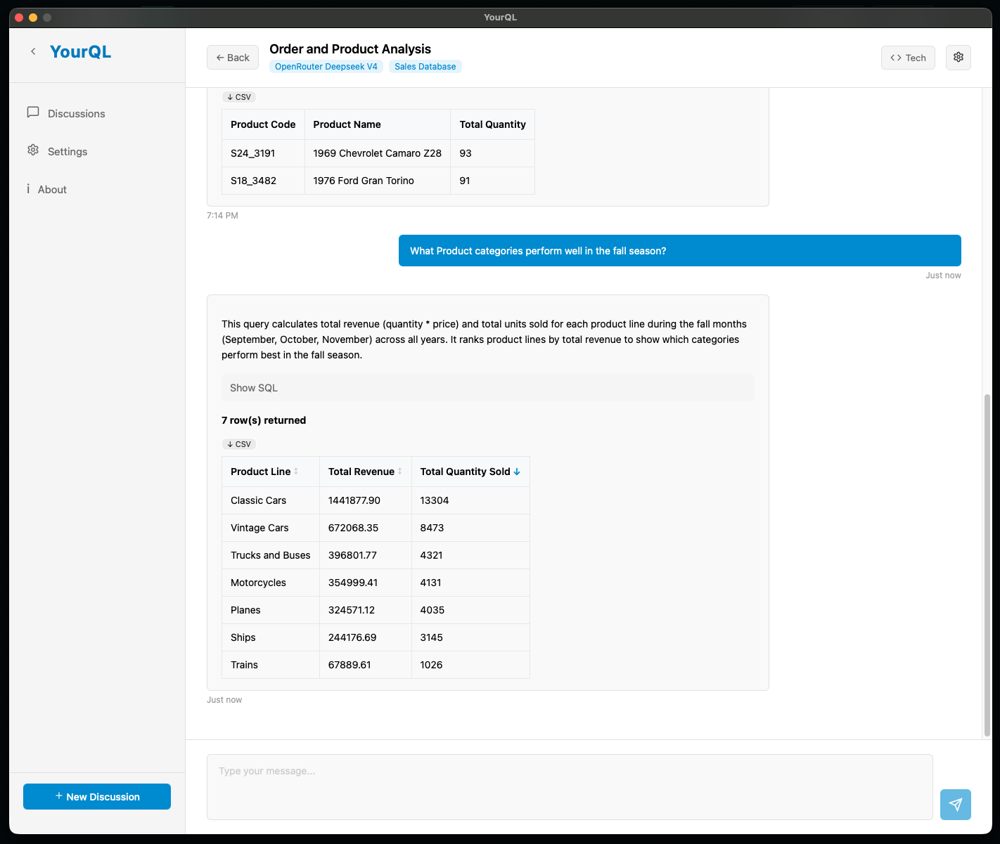
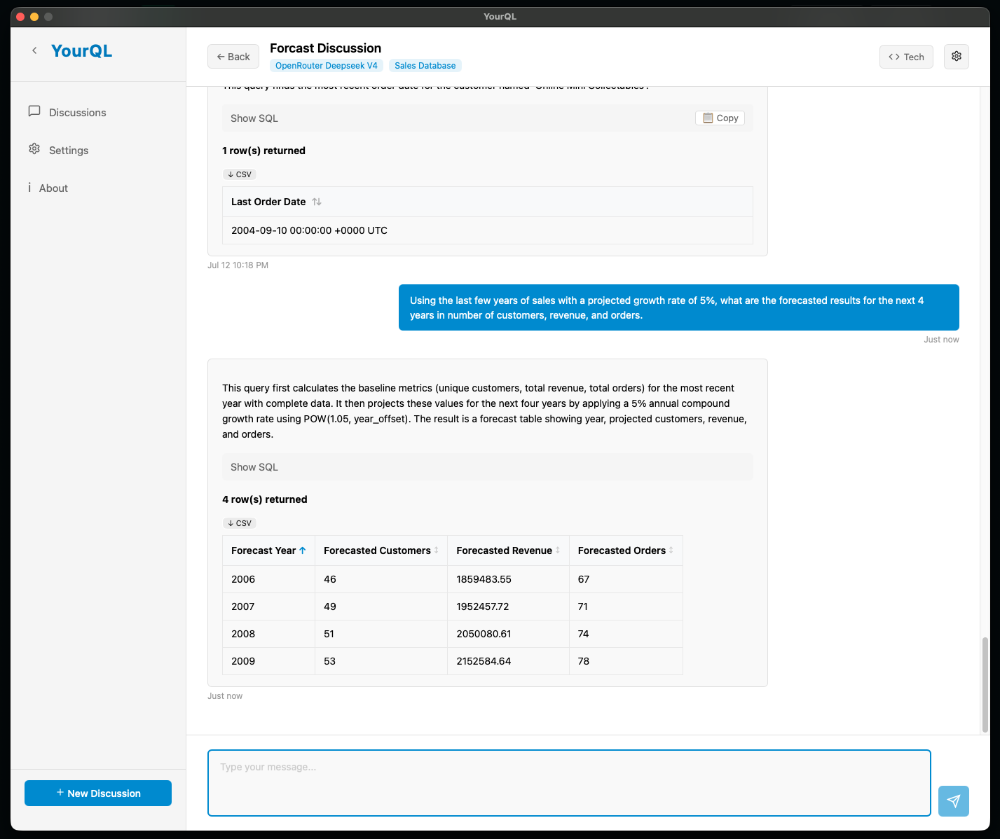
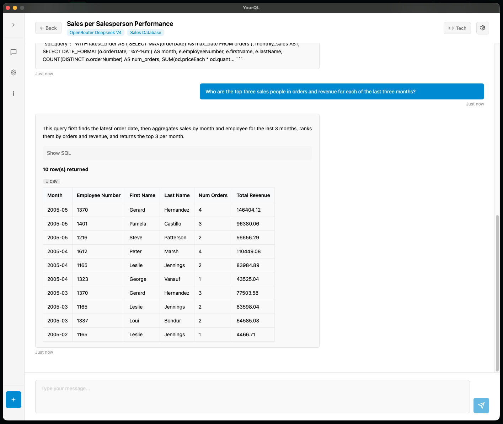
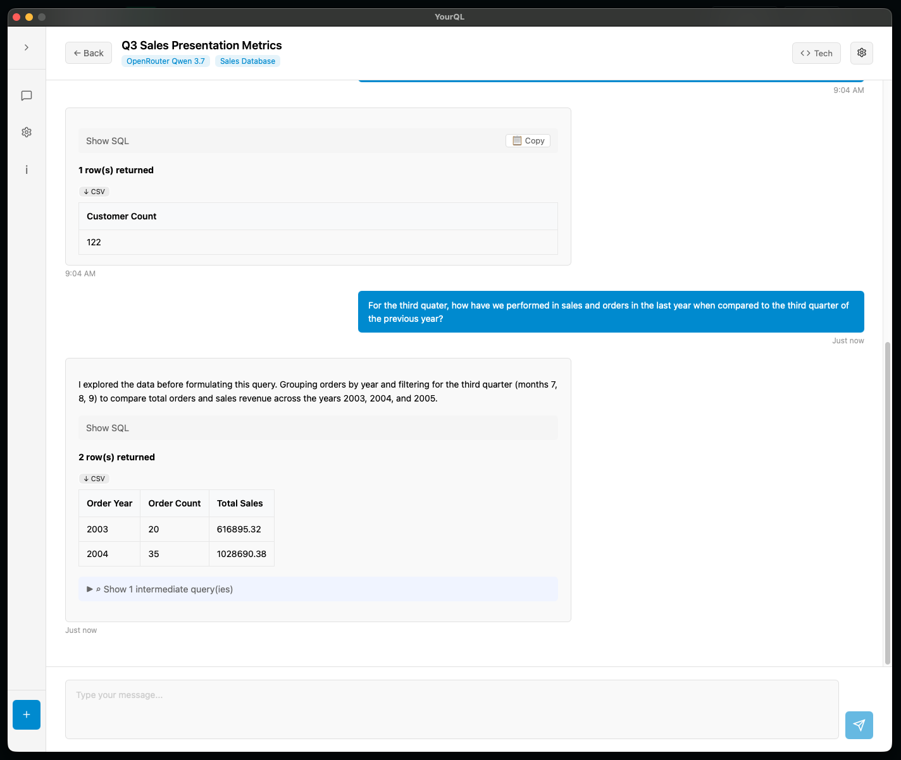
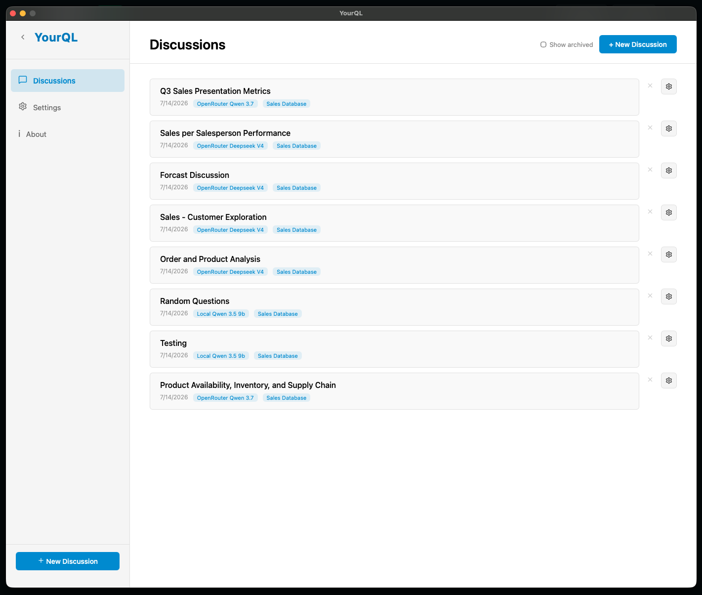
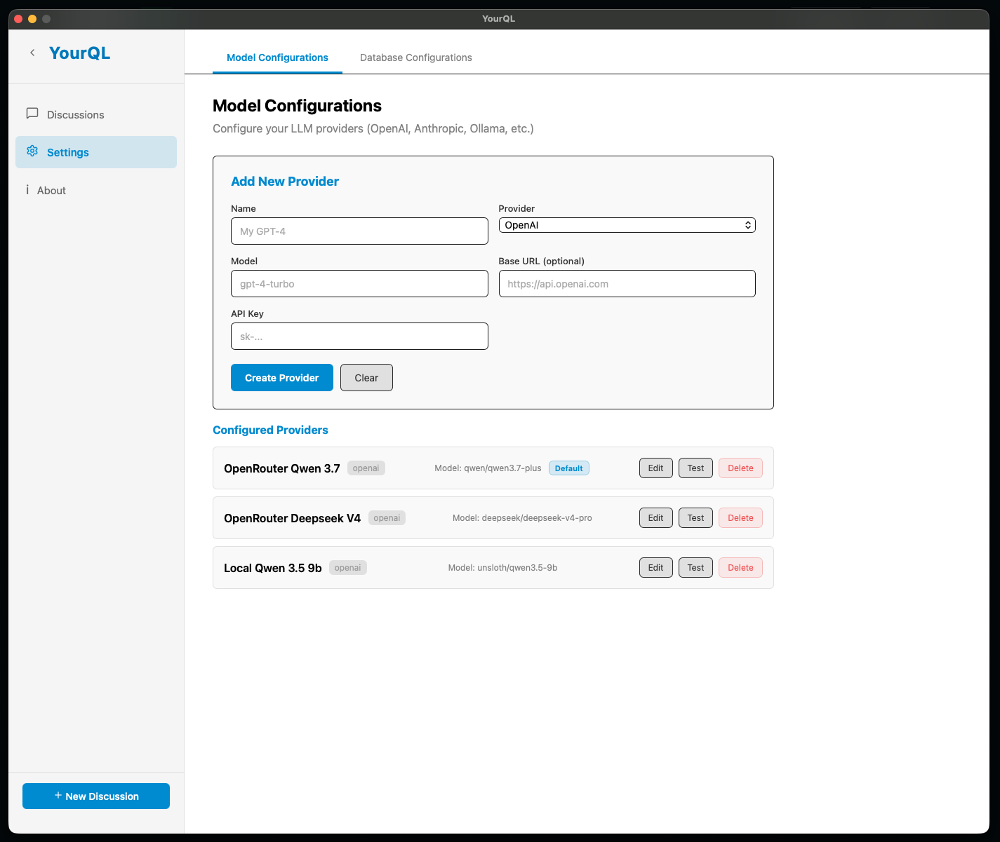

# YourQL

**Talk to your database in plain English.**

YourQL is a desktop application that lets you query your databases using natural language. Instead of writing SQL by hand, you ask questions the way you'd ask a colleague — and YourQL translates them into accurate, safe queries using your preferred AI model. The results come back as interactive tables, charts, and plain-English summaries.

Everything runs locally on your machine. Your database credentials, conversation history, and API keys never leave your computer unless you explicitly configure a cloud LLM provider.

---

## What You Can Do

- **Ask questions in plain English** — "How many orders shipped last month?" or "Show me the top 10 customers by revenue" — and get answers backed by real queries against your database.
- **Work across multiple databases** — Connect to MySQL, PostgreSQL, SQLite, SQL Server, Snowflake, BigQuery, Redshift, MariaDB, CSV files, Excel files, and Google Sheets.
- **Use your own AI model** — Bring your own OpenAI, Anthropic Claude, Ollama, or any OpenAI-compatible HTTP endpoint (LM Studio, llama.cpp, cloud-hosted models). Configure max tokens per provider.
- **Streaming responses** — See the LLM's answer stream in real-time, with token usage stats displayed per response.
- **Explore data safely** — Before writing a final query, YourQL can run read-only exploration queries to understand your schema, all within configurable safety constraints (strict/moderate/relaxed modes).
- **Visualize results** — Bar charts, line graphs, pie charts, scatter plots, and more, generated automatically when you ask for a visualization or when the data calls for one.
- **Summaries you can read** — Long tables of numbers are automatically summarized into plain-English answers so you don't have to decipher raw results. The summary is generated via a second LLM call, with the model's reasoning streamed live so you see activity instead of a spinning cursor.
- **Keep everything organized** — Tag discussions with labels, search across titles, tags, data sources, and models. Pin conversations to keep important threads at the top. Archive, duplicate, rename, or clear discussions. Limit how much history is sent to the LLM. Set a custom system prompt or business rules per database.
- **Define reusable Skills** — Write Markdown snippets with domain knowledge, business rules, or preferred query patterns and activate them per-conversation.
- **Persistent UI settings** — Theme (light/dark/system), accent color, UI scale, pipeline timeout, and summarization timeout survive app refreshes and restarts. Export discussions as PDF, HTML, or Markdown.
- **Fine-tune AI behavior (advanced)** — For power users, YourQL lets you customize the exact prompts, instructions, and tool descriptions your AI model receives — giving you full control over how it thinks about your data.

---

## Supported Connections

### AI Providers
| Provider | Description |
|---|---|
| **OpenAI** | GPT-4, GPT-4 Turbo, GPT-3.5 Turbo, and compatible APIs (OpenRouter, etc.) |
| **Anthropic** | Claude 3 Opus, Claude 3 Sonnet, Claude 3 Haiku |
| **Ollama** | Local, self-hosted models via Ollama |
| **Custom Endpoint** | Any OpenAI-compatible HTTP API — LM Studio, llama.cpp server, vLLM, cloud-hosted models (qwen, deepseek, etc.) |

### Database & Data Source Types
| Type | Status |
|---|---|
| MySQL | ✅ Supported |
| MariaDB | ✅ Supported |
| PostgreSQL | ✅ Supported |
| SQLite | ✅ Supported |
| SQL Server | ✅ Supported |
| Snowflake | ✅ Supported |
| BigQuery | ✅ Supported |
| Redshift | ✅ Supported |
| CSV Files | ✅ Supported |
| Excel Files (.xlsx) | ✅ Supported |
| Google Sheets | ✅ Supported (OAuth) |

---

## Screenshots

<p align="center">
  
  
</p>

<p align="center">
  
  
</p>

<p align="center">
  
  
</p>

---

## Getting Started

### Installation

Download the latest release for your operating system from the [Releases page](https://github.com/yourorg/yourql/releases).

#### macOS

Open the `.dmg` file and drag YourQL into your Applications folder. On first launch, you may need to right-click → **Open** to bypass Gatekeeper if the app isn't notarized.

#### Linux

Download the AppImage, make it executable, and run:

```bash
chmod +x YourQL-*.AppImage
./YourQL-*.AppImage
```

#### Windows

Run the `.exe` installer and follow the prompts.

### First-Time Setup

1. **Add an AI provider** — Open Settings → Model Configurations and click **Add New Provider**. Enter a name, choose the provider type, specify the model, and provide your API key or base URL. Click **Create Provider**, then **Set as Default**.

2. **Connect a database** — Open Settings → Data Sources and click **+ Add Connection**. Fill in the connection details for your database, then click **Test Connection** to verify it works. Click **Save**, then **Set as Default**.

3. **Start a discussion** — Click **New Discussion** in the sidebar, give it a title, select an LLM provider and data source, and start asking questions about your data.

### Upgrading

Replace your current binary with the new one. All your conversations, settings, credentials, and UI preferences are stored in `~/.yourql/yourql.db` and survive upgrades automatically. See [`documentation/VERSION_UPGRADE.md`](documentation/VERSION_UPGRADE.md) for details.

---

## How It Works

When you ask a question, YourQL does the following behind the scenes:

1. **Reads your schema** — Tables, columns, types, primary keys, foreign keys, and row counts are gathered from your database.
2. **Builds a prompt** — The schema, your question, any custom system prompt, business rules, and active skills are assembled into a structured prompt for the LLM.
3. **Calls the LLM** — The prompt is sent to your configured AI provider. The LLM responds with a JSON action: `sql_query` (execute this SQL), `clarification` (ask the user for more detail), or `sql_exploration` (run a read-only query to understand the data better before writing the final query). Responses stream in real-time with token usage counters.
4. **Explores if needed** — If the LLM chooses exploration, it runs safe, read-only queries (constrained by configurable safety modes) and uses the results to refine its understanding.
5. **Executes the final query** — The generated SQL is run against your database. If it fails, YourQL sends the error back to the LLM for automatic correction and retry.
6. **Renders the results** — Results appear as an interactive, sortable table. If you've enabled summaries or visualizations, those are generated and displayed above the table. A tech details toggle reveals the exact SQL, raw LLM payload, and token breakdown.

---

## Conversation Settings

Every discussion has its own settings panel (click the gear icon):

- **LLM Provider** — Which AI model powers this discussion
- **Data Source** — Which database this discussion queries
- **Messages in Context** — How many recent messages are sent to the LLM (prevents context-window overflow with long conversations)
- **Max Messages** — Total messages stored in the conversation history
- **Summarize Results** — Let the LLM write a plain-English summary above each result table
- **Data Visualization** — Let the LLM generate charts (bar, line, pie, scatter, etc.) when appropriate
- **Show Tech Details** — Reveal raw SQL, LLM request/response payloads, and token usage
- **Show Context Details** — View the full prompt messages sent to the LLM
- **Skills** — Enable/disable per-conversation skills from your skill library
- **Pin, Duplicate, Clear, Archive, Delete** — Standard conversation management. Archived conversations show a colored left-border indicator.

---

## Data Source Configuration

Each database connection supports deep customization:

- **Custom System Prompt** — Override the default prompt for a specific database (inject domain knowledge, naming conventions, etc.)
- **Business Rules** — One-per-line rules injected into every query prompt (e.g., "Never expose customer SSN", "Always use ISO date format")
- **Table & Column Descriptions** — After loading the schema, add human-readable descriptions for tables and columns so the LLM understands your domain
- **Exploration Settings** — Control when and how the LLM can explore your data:
  - **Strict** — Simple SELECT only; no JOINs, subqueries, UNION, GROUP BY, or ORDER BY
  - **Moderate** — Single-table JOIN, GROUP BY, and ORDER BY allowed
  - **Relaxed** — Subqueries and UNION allowed (still read-only)
- **Query Limits** — Set default and exploration row limits, query length thresholds

---

## Skills

Skills are reusable Markdown prompt fragments you define in Settings. Write a skill for your organization's naming conventions, common query patterns, or any domain knowledge you want the LLM to reference. Then enable one or more skills per conversation — the content is injected into the system prompt for discussions where they're active.

## Advanced Agent Loop Settings

For users who want fine-grained control over how their AI model behaves, YourQL includes an **Agent Loop** settings tab — hidden by default behind a toggle on the General settings page. This gives you direct control over the exact text your model receives.

You can customize:

- **Tool descriptions** — What the model is told about each tool (querying the database, responding to the user, generating charts). Adjusting these changes when and how the model decides to use each capability.
- **System instructions** — The step-by-step guidance the model follows. For example, you can tune how strongly it's encouraged to add commentary and analysis alongside query results.
- **Safety rule descriptions** — What the model is told about exploration guardrails. (Note: the actual safety enforcement is handled by YourQL's code — these descriptions only affect what the model *thinks* is allowed.)
- **Chart guidance** — How and when the model should generate visualizations.
- **Error recovery messages** — The responses YourQL sends back to the model when something goes wrong, shaping how it recovers from mistakes.

Every field starts with a sensible default that matches YourQL's standard behavior. A **Reset** button per field and a **Restore All Defaults** button at the top make it safe to experiment — you can always get back to the original settings with one click.

This feature is designed for advanced users who understand prompt engineering. Most users will never need to open this tab — YourQL's defaults are tuned for accuracy and safety out of the box.

---

## App Settings

YourQL remembers your preferences across sessions. All settings are persisted in the local database:

| Setting | Options | Description |
|---|---|---|
| **Theme** | Light, Dark, System | Follows OS preference in System mode |
| **Accent Color** | Blue, Green, Orange, Purple, Red, Teal, or custom hex | Applied to buttons, links, borders, and interactive elements |
| **UI Scale** | Small, Medium, Large | Adjusts text size and spacing across the entire interface |
| **Pipeline timeout** | 30–3600 seconds | Maximum time for an entire conversation turn (default: 180s) |
| **Summarization timeout** | 10–600 seconds | Maximum time for the result-summary LLM call (default: 300s) |

Settings survive app refreshes, restarts, and upgrades. On first launch after upgrading from a version that stored settings in browser storage, your existing preferences are automatically migrated.

---

## Security & Privacy

- **Your data stays local** — All conversations, settings, and connection details are stored in a local SQLite database at `~/.yourql/yourql.db`. Nothing is sent to the cloud unless you configure a cloud LLM provider.
- **API keys and passwords are stored locally** — Provider API keys and database credentials are saved in the same local database. They are never serialized to the frontend and never sent to any server other than the LLM provider you configure. Editing other provider or data source settings will not clear your existing API key or password.
- **Read-only by design** — YourQL is built on an absolute read-only invariant. `INSERT`, `UPDATE`, `DELETE`, `DROP`, `ALTER`, and any other write operations are unconditionally forbidden against configured data sources. Only `SELECT` statements (and read-only CTEs) are allowed.
- **No telemetry, no analytics, no phoning home** — YourQL does not collect usage data or communicate with any server other than the LLM API endpoint you configure and the databases you connect to.

---

## Technical Architecture

YourQL is built with [Wails v2](https://wails.io/), combining a Go backend with a Svelte 5 frontend.

| Layer | Technology |
|---|---|
| Desktop framework | Wails v2 |
| Backend | Go |
| Frontend | Svelte 5 + Vite |
| Charts | Chart.js 4 |
| App database | SQLite (via `modernc.org/sqlite`, pure Go) |
| External databases | Native drivers per type (see list above) |
| LLM APIs | OpenAI, Anthropic, Ollama, custom HTTP endpoints |

The agentic tool-calling loop is isolated in `pkg/engine/` as a black-box package — it depends only on three injected interfaces (`LLMClient`, `QueryExecutor`, `OutputHandler`) and has zero knowledge of the app database, Wails, or the filesystem. This makes the loop's round behavior, safety validation, error retry, and one-shot finality fully testable with mocks. See `documentation/FUNCTIONALITY_SILO_DEFINITIONS.md` for the full architecture.

### Data Storage

All application data — conversations, messages, provider configs, connection configs, skills, and UI preferences — is stored in `~/.yourql/yourql.db`. The database is created automatically on first run. Schema migrations are handled non-destructively with automated column addition and migration tracking.

### LLM Integration

The LLM interface is provider-agnostic. Each provider implements a common `LLMClient` interface supporting chat completion (streaming and non-streaming) with full request/response payload capture for debugging. The system prompt is dynamically built per-conversation from schema metadata, custom configuration, and active skills.

### Multi-Database Support

Database drivers implement a common `DBDriver` interface with methods for DSN construction, schema introspection, and dialect-aware prompt generation. Drivers for native-API databases (BigQuery, Google Sheets) also implement an optional `NativeQuerier` interface for query execution without `database/sql`.

### Safety Architecture

Query execution is guarded by multiple layers of safety checks in `sql_execution.go`. All data source queries are restricted to `SELECT` only. Exploration safety modes control query complexity (joins, subqueries, unions) without ever opening a path to write statements. The app's own validation is the primary safety control — it does not rely on the user's database role permissions as the sole safeguard.

---

## Documentation

Comprehensive documentation is available in the [`documentation/`](documentation/) directory:

| Document | Description |
|---|---|
| [`AGENT_READ_FIRST.md`](documentation/AGENT_READ_FIRST.md) | Project charter — fundamental goal, risk framework, and coding standards for all contributors |
| [`RELEASE_DEPLOYMENT.md`](documentation/RELEASE_DEPLOYMENT.md) | Release process for macOS, Windows, and Linux — build commands, signing, packaging, CI |
| [`VERSION_UPGRADE.md`](documentation/VERSION_UPGRADE.md) | How users upgrade — manual (works today) and automatic (planned) |
| [`TESTING_SUITE.md`](documentation/TESTING_SUITE.md) | Testing strategy and test coverage |
| [`TECH_REVIEW.md`](documentation/TECH_REVIEW.md) | Comprehensive technical review and architecture audit |
| [`RISK_ANALYSIS_LOG.md`](documentation/RISK_ANALYSIS_LOG.md) | Log of risk/reward analyses for significant changes |
| [`STREAMING_ENHANCEMENT.md`](documentation/STREAMING_ENHANCEMENT.md) | Streaming LLM response implementation |
| [`TOOL_CALL_ENHANCEMENT.md`](documentation/TOOL_CALL_ENHANCEMENT.md) | Tool-calling and function-calling support |
| [`DARK_MODE_ENHANCEMENT.md`](documentation/DARK_MODE_ENHANCEMENT.md) | Dark mode implementation details |
| [`DATA_VIZ_ENHANCEMENT.md`](documentation/DATA_VIZ_ENHANCEMENT.md) | Chart and visualization system |
| [`SKILLS_ENHANCEMENT.md`](documentation/SKILLS_ENHANCEMENT.md) | Skills system design |
| [`FUNCTIONALITY_SILO_DEFINITIONS.md`](documentation/FUNCTIONALITY_SILO_DEFINITIONS.md) | Architecture silos — what each logical section is, how they connect, and what black-boxing them requires |
| [`FUNCTIONALITY_SILO_TARGET.md`](documentation/FUNCTIONALITY_SILO_TARGET.md) | End-state target architecture — interfaces, package layout, and wiring |
| [`FUNCTIONALITY_SILO_PLAN.md`](documentation/FUNCTIONALITY_SILO_PLAN.md) | Step-by-step extraction plan with risk register |
| [`AGENT_LOOP_DETAILS.md`](documentation/AGENT_LOOP_DETAILS.md) | Complete reference — every path, tool, limit, prompt, and termination state in the agentic loop |
| [`DISC_SEARCH.md`](documentation/DISC_SEARCH.md) | Discussion tags and search — implementation spec |
| [`GOOGLE_SHEETS_ENHANCEMENT.md`](documentation/GOOGLE_SHEETS_ENHANCEMENT.md) | Google Sheets integration (OAuth) |
| [`ANSWER_ENHANCEMENT.md`](documentation/ANSWER_ENHANCEMENT.md) | Answer rendering and quality improvements |
| [`ANSWER_CLARIFICATION_ISSUE.md`](documentation/ANSWER_CLARIFICATION_ISSUE.md) | Clarification flow analysis |
| [`MODEL_ERRORS_ENHANCEMENT.md`](documentation/MODEL_ERRORS_ENHANCEMENT.md) | Model error handling and recovery |
| [`MAX_TOKEN_ENHANCEMENT.md`](documentation/MAX_TOKEN_ENHANCEMENT.md) | Per-provider max token configuration |
| [`HELP_CHAT_ENHANCEMENT.md`](documentation/HELP_CHAT_ENHANCEMENT.md) | In-app help and onboarding |
| [`AGENT_LOOP_CONFIG.md`](documentation/AGENT_LOOP_CONFIG.md) | User-configurable prompts, tool descriptions, and model instructions (advanced) |

---

## Development

### Prerequisites

- Go 1.21+
- Node.js 18+
- Wails CLI: `go install github.com/wailsapp/wails/v2/cmd/wails@latest`

### Building

```bash
# Generate Wails bindings
wails generate module

# Build the full application
wails build

# Run in development mode with hot reload
wails dev
```

### Project Structure

```text
YourQL/
├── app.go                       # Wails bindings (Go ↔ frontend bridge)
├── main.go                      # Application entry point
├── pkg/
│   ├── engine/                 # Isolated agentic loop — types, interfaces,
│   │                           #   safety validation, rendering, charts, loop logic
│   ├── models/                 # Data structures, DB schemas, migrations
│   └── services/               # Core logic — orchestration, LLM clients,
│                               #   SQL execution, drivers, tags, adapters
├── frontend/                    # Svelte 5 UI
│   └── src/
│       ├── main.js              # App bootstrap, theme/accent/scale init & persistence
│       ├── variables.css         # CSS custom properties (theming, scaling)
│       ├── App.svelte           # Sidebar, navigation, discussion list
│       ├── ConversationView.svelte  # Chat interface, message display, streaming
│       ├── SettingsView.svelte  # LLM providers, data sources, skills, appearance
│       └── VizChart.svelte      # Chart.js visualization component
├── build/                       # Platform-specific build assets (icons, installers)
├── scripts/                     # Linux AppImage build scripts
├── documentation/               # Comprehensive project documentation
└── screenshots/                 # UI screenshots
```

---

## License

YourQL is open-source software. See the [LICENSE](LICENSE) file for details.

---

## Disclaimer

The AI models you configure will have access to the databases you configure. Use responsibly with databases containing sensitive data. YourQL can be deployed in an air-gapped or local-network-only environment so that models and databases remain isolated, but this requires technical knowledge and deliberate configuration.
